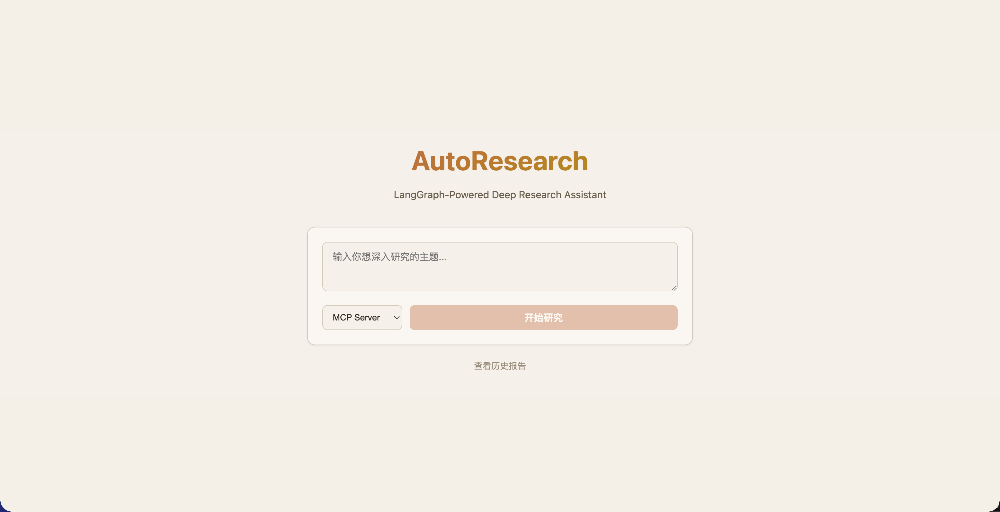
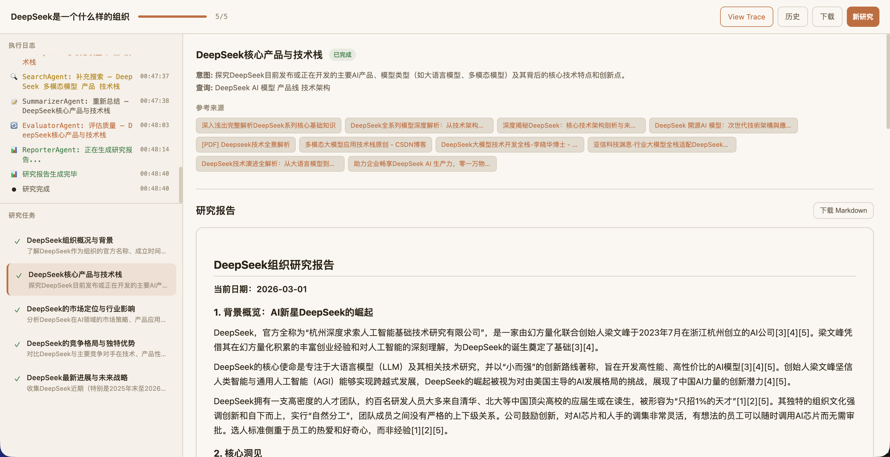
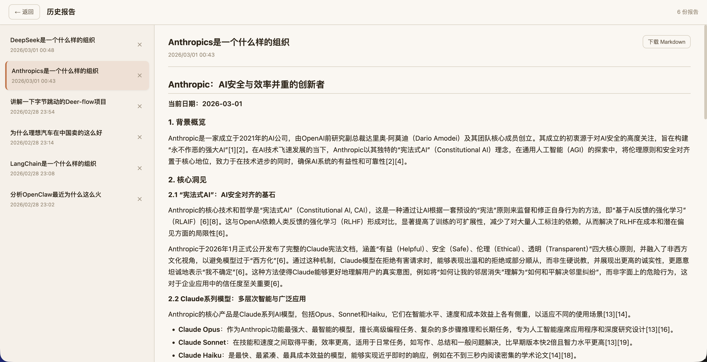
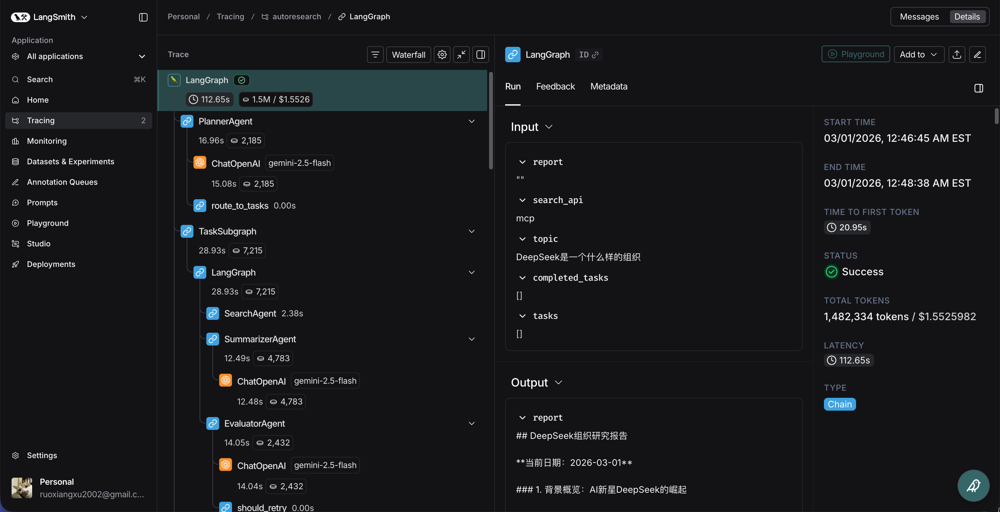

# AutoResearch Agent

AI-powered deep research assistant built with LangGraph. Given a research topic, it automatically plans sub-tasks, searches the web in parallel, summarizes findings with self-correction, and generates a structured report with proper citations.









## Architecture

The research pipeline is orchestrated as a LangGraph `StateGraph` with native `Send()` fan-out for parallel task execution.

**Main Graph:**

```
START → PlannerAgent → [TaskSubgraph × N via Send()] → ReporterAgent → END
```

**Task Subgraph** (runs N instances in parallel):

```
SearchAgent → SummarizerAgent → EvaluatorAgent
                                      │
                         needs_retry?  ├─ No  → END
                                      └─ Yes → SearchAgent (refined query)
```

- **Fan-out**: `PlannerAgent` generates 3–5 sub-tasks; `route_to_tasks()` returns a `list[Send]` to dispatch them concurrently
- **Fan-in**: `completed_tasks` uses `Annotated[list, operator.add]` as a LangGraph reducer to accumulate results
- **Self-correction**: `EvaluatorAgent` scores summary quality (<6/10 triggers retry with a refined search query)

### Agents

| Agent | Role |
|-------|------|
| **PlannerAgent** | Decomposes the research topic into 3–5 complementary sub-tasks with titles, intents, and search queries |
| **SearchAgent** | Executes web search via Tavily, DuckDuckGo, or MCP server |
| **SummarizerAgent** | Streams a structured summary from search results with source citations |
| **EvaluatorAgent** | Assesses summary quality; triggers retry with refined query if score < 6/10 |
| **ReporterAgent** | Synthesizes all task summaries into a final report with deduplicated, globally-numbered references |

### Search Providers

- **Tavily** — via API or MCP server
- **DuckDuckGo** — free, no API key needed

## Tech Stack

- **Backend**: Python, FastAPI, LangGraph, LangChain, SSE streaming
- **Frontend**: Vue 3, TypeScript, Vite, Marked (markdown rendering)
- **LLM**: Any OpenAI-compatible API
- **Database**: SQLite (aiosqlite) for report history
- **Observability**: LangSmith tracing (optional)

## Quick Start

### Backend

```bash
cd backend
pip install -e .
cp .env.example .env   # Edit with your API keys
python -m uvicorn src.main:app --reload
```

### Frontend

```bash
cd frontend
npm install
npm run dev
```

Open `http://localhost:5174` in your browser.

## Configuration

Copy `backend/.env.example` to `backend/.env` and configure:

| Variable | Description | Default |
|----------|-------------|---------|
| `LLM_MODEL_ID` | Model name for OpenAI-compatible API | `gpt-4.1-mini` |
| `LLM_API_KEY` | API key | — |
| `LLM_BASE_URL` | Base URL for the API | — |
| `SEARCH_API` | Search provider: `tavily`, `duckduckgo`, or `mcp` | `duckduckgo` |
| `TAVILY_API_KEY` | Tavily API key (if using tavily/mcp) | — |
| `MAX_RETRY_COUNT` | Self-correction retries per task (0 to disable) | `1` |

### LangSmith Tracing (optional)

Enable [LangSmith](https://smith.langchain.com) to visualize the full execution graph with per-node latency and token usage. After research completes, a **View Trace** button appears in the UI.

```env
LANGCHAIN_TRACING_V2=true
LANGCHAIN_API_KEY=your-langsmith-api-key
LANGCHAIN_PROJECT=autoresearch
```

## License

MIT
